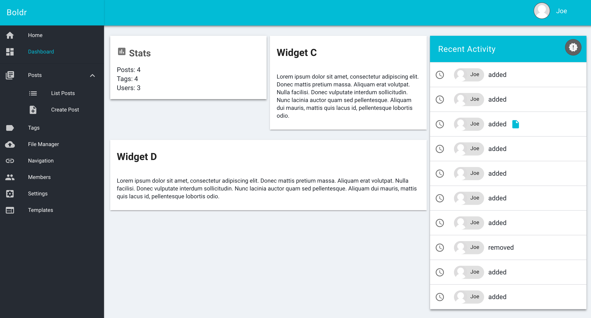
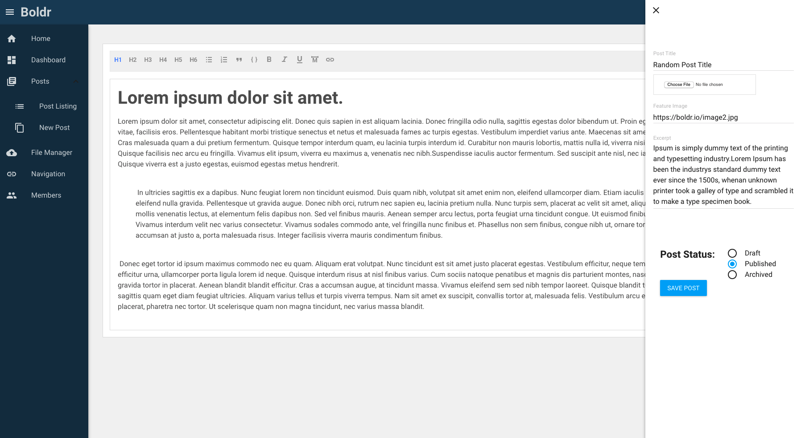
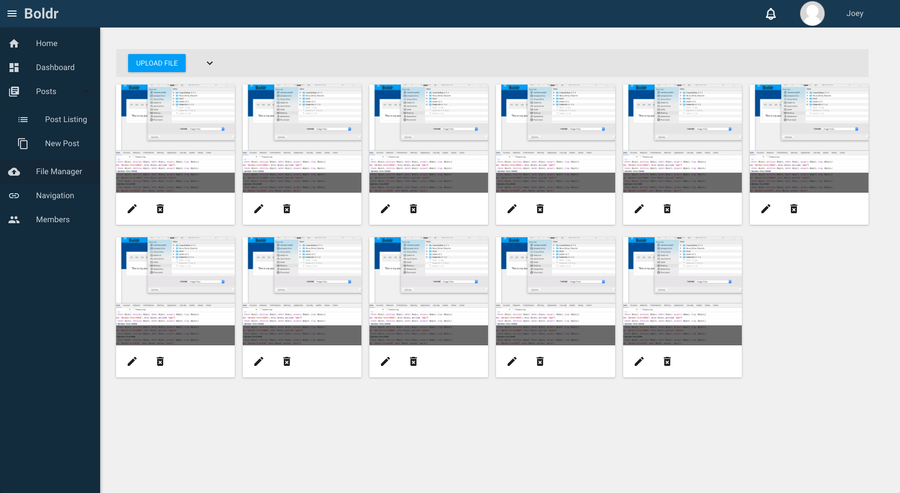

[![Build Status][circle-img]][circle-link] [![Code Climate][cc-img]][cc-link]   [![Gitter][gitter-img]][gitter-link] 

# What's Boldr?

Boldr is a modern content management framework. Think of Boldr as the solid foundation for building your next great web application. Unlike other CMS platforms, Boldr is entirely JavaScript. It features Universal / Isomorphic rendering for improved performance and Search Engine Optimization. Boldr uses Postgres as its database. Express serves the standalone API and the server-side rendering application. Redis provides the store for user sessions and query caching.

**Table of Contents**
- [Boldr](#boldr)
- [Core Technologies](#core-technologies)
- [Getting Started / Installation](#getting-started-installation)
- [Editor](#editor)
- [Usage](#usage)
  - [Development](#development)
  - [Production](#production)
- [Contributing](#contributing)
- [Documentation](#documentation)
- [Demo](#demo)

## Screenshots

    

## Core Technologies

- [Node](https://github.com/nodejs/node)
- [Express](https://github.com/expressjs/express)
- [React](https://github.com/facebook/react)
- [Postgres](https://github.com/postgres/postgres) ([Knex](http://knexjs.org/) & [Objection](https://github.com/Vincit/objection.js/))
- [Redis](http://redis.io/)
- [Docker](https://github.com/docker/docker)
- [Webpack v2](https://github.com/webpack/webpack)

## Getting Started / Installation

**Development Disclaimer:** At the moment, Boldr is in active development. Meaning there might be the occasional breaking changes, and architectural adjustments.

That said, I'm confident the majority of large breaking changes is behind us.

1. `git clone https://github.com/strues/boldr.git`
2. `yarn install`
3. `yarn bootstrap`
4. Modify environment variables within **both** packages/boldr-cms and packages/boldr-api: `cp .env_example .env`

## Usage

Quick notes:

- Ports

  - **Frontend**: 3000 - _React SSR server_  
  - **Webpack**: 3001 - _dev only_  
  - **API**: 2121  

- The `boldr-api` package can operate independently from boldr-cms. However, `boldr-cms` requires the api to be running. BCMS depends on data retrieved from the api.

### Development

#### API

Context: `packages/boldr-api`

Create a Postgres database and modify the migrate and seed scripts within the `package.json` to match your newly created database.

Run the migrate command with `npm run migrate` followed by `npm run seed`. This bootstrap's your database.

Tweak any of the `.env` variables to match your preferences / environment

Start the api with the command, `npm run dev`

#### CMS

Context: `packages/boldr-cms`

Run the CMS using `npm run dev`

After Boldr has started visit <http://localhost:3000>. The admin account is already created and you may login using these credentials:

> Email - admin@boldr.io 
> Password - password

Settings for the build process as well as misc configurations located within the config directory in the `index.js` file.

### Production

Running Boldr in production is fairly simple. We'll go over the steps right now in order to get you up and running as soon as possible. Please bear with us, as the process for automation continues to evolve.

From the root directory use the command, `make build`.

The `make build` command creates a folder named boldr in the root of the repository. Then compiles all files and copies them to the boldr folder.

Upload the contents of the boldr directory to your preferred host.

Install the production dependencies for both the `boldrAPI` and `boldrCMS` packages using `npm install --production`.

Finally using pm2 or your preferred script, start the API and CMS.

Please [`See the documentation`](docs/production.md) for a detailed explanation.

## Contributing

Looking for an open source project to contribute to? All types of contributions are welcome here. Take a look at some of the [current issues](https://github.com/strues/boldr/issues) and see if you find something you'd like to help out with. Feel free to submit pull requests to the develop branch.

**Contribution Area Ideas**

- Documentation
- Designs
- React
- Node
- Build / Installation
- Play a major role in a community driven project, have some fun, and work on improving your skills.

## Documentation

- [`Roadmap`](ROADMAP.md)
- [`API`](docs/apidoc.md)
- [`Theming`](docs/theming.md)
- [`Docker`](docs/docker.md)
- [`Production`](docs/production.md)
- [`Nginx`](docs/nginx.md)
- [`Troubleshooting`](docs/troubleshooting.md)
- [`State Tree`](docs/statetree.md)

## Screenshots

## Demo

View a **very early** demo at <https://staging.boldr.io>

> Email - admin@boldr.io 
> Password - password

[cc-img]: https://codeclimate.com/github/strues/boldr/badges/gpa.svg
[cc-link]: https://codeclimate.com/github/strues/boldr
[circle-img]: https://circleci.com/gh/strues/boldr.svg?style=svg
[circle-link]: https://circleci.com/gh/strues/boldr
[gitter-img]: https://badges.gitter.im/Join%20Chat.svg
[gitter-link]: https://gitter.im/boldr/Lobby?utm_source=badge&utm_medium=badge&utm_campaign=pr-badge&utm_content=badge
[coverage-link]: https://codeclimate.com/github/strues/boldr/coverage
[coverage-img]: https://codeclimate.com/github/strues/boldr/badges/coverage.svg
