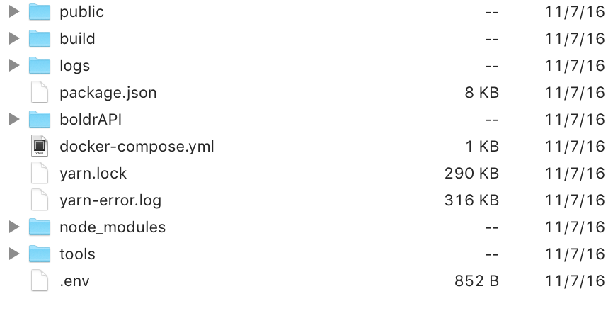

[![Build Status][circle-img]][circle-link] [![Code Climate][cc-img]][cc-link]   [![Gitter][gitter-img]][gitter-link] 

# Boldr

Boldr is an up and coming, modern content management framework / system. Boldr is a solid starting point for building your next great web application. In the future, the goal is to shape Boldr into a full content management system. However, here in the present, a framework, or strong base, is the most accurate way to describe the project. Boldr is built upon React, Node.js, and Postgres. It offers server-side rendering and a standalone REST api.

_If you made it this far, I know what you're probably thinking..._ The world doesn't need another _never-to-be finished_ CMS project, nor does it need the "next WordPress". Boldr is none of that. Over the course of the past five or so months, my spare time has been invested into this passion project.

**Table of Contents**
- [Boldr](#boldr)
  - [Core Technologies](#core-technologies)
- [Getting Started / Installation](#getting-started-installation)
- [Editor](#editor)
- [Usage](#usage)
  - [Development](#development)
  - [Production](#production)
- [Contributing](#contributing)
- [Documentation](#documentation)
- [Demo](#demo)

 > Your dreams are bold. Your thoughts are bold. So why shouldn't your CMS be a little, **Boldr**?

## Core Technologies

- [Node](https://github.com/nodejs/node)
- [Express](https://github.com/expressjs/express)
- [React](https://github.com/facebook/react)
- [Postgres](https://github.com/postgres/postgres) ([Knex](http://knexjs.org/) & [Objection](https://github.com/Vincit/objection.js/))
- [Redis](http://redis.io/)
- [Docker](https://github.com/docker/docker)
- [Webpack v2](https://github.com/webpack/webpack)

## Getting Started / Installation

**A word of caution:** At the moment, Boldr is in active development. Meaning there can and most likely will, be the occasional breaking changes, and architectural adjustments.

That being said, I'm fairly confident the majority of large breaking changes is behind us.

1. `git clone https://github.com/boldr/boldr.git`
2. `cd boldr && yarn install / npm install`
3. `cp env.example .env` and open it up in your preferred editor.
4. The .env file contains nearly every configuration option available for you. The actual configuration is located in `src/api/config/config`. I recommend using the `config.js` file and only using the .env for secrets because **.env overrides the default config values.**
5. `docker-compose up -d` unless you're running Postgres and Redis already.
6. `npm run migrate` followed by `npm run seed` in order to populate the database tables.

## Usage

Quick notes:

- Ports

  - **Frontend**: 3000 - _this is also the ssr server_  
  - **Webpack**: 3001 - _dev only_  
  - **API**: 2121  

- Hot reloading doesn't work everywhere due to async/dynamic routes.

### Development

**Setup the Database** -- Modify the config settings with your database information. Then simply run `npm run migrate` and `npm run seed`.  

**Starting it up** -- Run `npm run dev`  

After Boldr has started visit <http://localhost:3000>. The admin account is already created and you may login using these credentials:

> Email - admin@boldr.io 
> Password - password

### Production

> I wouldn't recommend it for a serious website. Not yet. However if you feel like building the application as if it were production execute the following.

Running Boldr in production is fairly simple. We'll go over the steps right now in order to get you up and running as soon as possible. Please bear with us, as the process for automation continues to evolve.

**Steps**
- Build BoldrCMS and BoldrAPI by running `make build`.
- Upload the contents of the `dist` folder to one directory above your web root.
- Upload the contents of `public` to your web root.
- Upload `public` folder and ensure it is set to be served as your web root.
- Install the production dependencies on your server with `npm install --production`.
- Upload `docker-compose.yml` and run `docker-compose up -d`.
- Run `npm run migrate:prod` and `npm run seed:prod`.
- Start the API with `npm run start:api`.
- Start the CMS with `npm run start:cms`.

The start commands expect [PM2](http://pm2.keymetrics.io/) to be installed globally on your server. The API start command expects your `postgres__uri` env variable to be modified so that it matches your actual postgres connection.

**Directory Structure**
An example of how your directory containing Boldr should look is as follows:

[`See the documentation`](docs/production.md)  

## Contributing

Looking for an open source project to contribute to? All types of contributions are welcome here. In fact, I'd love some assistance. Take a look at some of the [current issues](https://github.com/boldr/boldr/issues) and see if you find something you'd like to help out with. Feel free to submit pull requests to the develop branch.

**Contribution Area Ideas**

- Documentation
- Designs
- React
- Node
- Build / Installation
- Play a major role in a community driven project, have some fun, and work on improving your skills.

## Documentation

- [`Roadmap`](ROADMAP.md)
- [`API`](docs/apidoc.md)
- [`Theming`](docs/theming.md)
- [`Docker`](docs/docker.md)
- [`Production`](docs/production.md)
- [`Nginx`](docs/nginx.md)
- [`Troubleshooting`](docs/troubleshooting.md)

## Screenshots
|  |
|---|---|
| |  |

## Demo

View a **very early** demo at <https://staging.boldr.io>

> Email - admin@boldr.io 
> Password - password

[cc-img]: https://codeclimate.com/github/boldr/boldr/badges/gpa.svg
[cc-link]: https://codeclimate.com/github/boldr/boldr
[circle-img]: https://circleci.com/gh/boldr/boldr.svg?style=svg
[circle-link]: https://circleci.com/gh/boldr/boldr
[gitter-img]: https://badges.gitter.im/Join%20Chat.svg
[gitter-link]: https://gitter.im/boldr/Lobby?utm_source=badge&utm_medium=badge&utm_campaign=pr-badge&utm_content=badge
[coverage-link]: https://codeclimate.com/github/boldr/boldr/coverage
[coverage-img]: https://codeclimate.com/github/boldr/boldr/badges/coverage.svg
