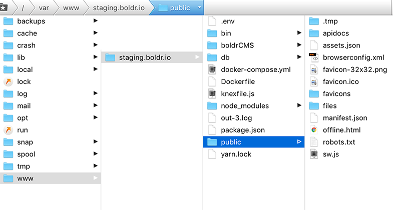

# Production

Running Boldr in production is fairly simple. The following steps will get you up and running as soon as possible. Please bear with us, as the process for automation continues to evolve.

## Steps
1. Install all dependencies with `yarn install` or `npm install`
2. Modify any configuration settings within `config/values.js`.
3. Run the command `make release`.
  a. The **release** command compiles all files together using Webpack.
  b. It copies all necessary production files to a new directory called release.
4. Upload the contents of the `release` directory to one directory above your web root (assuming your web root is public). See image for clarity.

5. Install the production dependencies on your server with `npm install --production`.
6. Setup Postgres and Redis (see below for alternative).
  a. If you're using the included Docker-Compose file, all there is to do is run `docker-compose up -d --build`.

  It will pull the official Alpine Redis image and build a Postgres container using the official Alpine Postgres image. The Postgres container already has the database files in place.  

7. Fire it up using `npm start`.

Help
---------

#### Postgres and Redis Alternative Setup
