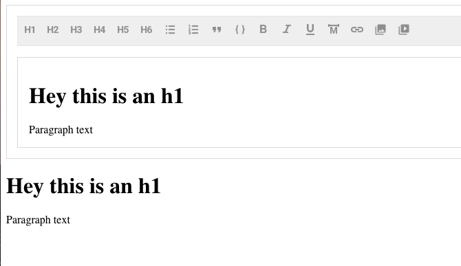

#BoldrEditor

> Built on top of [Draft-js](https://github.com/facebook/draft-js), BoldrEditor is a rich text editor extracted from [BoldrCMS](https://github.com/strues/boldr).


By default in this first release, everything input into the editor is converted to HTML. In the future, the ability to output raw and markdown, is a possibility.

Out of respect for making BoldrEditor fairly simple for anyone to pickup and use, you must manually include the stylesheet from the node_modules folder. This way provides the most freedom when it comes to your build process.

BoldrEditor works seamlessly with [Redux Form](https://github.com/erikras/redux-form).



## Usage

`yarn add boldr-editor`

```javascript
import React from 'react';
import BoldrEditor from 'boldr-editor';
// or
import { BoldrEditor, defaultBlocks } from 'boldr-editor';
import '../node_modules/boldr-editor/dist/boldreditor.css';

class Example extends Component {
  constructor() {
    super();
    this.state = {
      content: {
        entityMap: {},
        blocks: [
          {
            text: '',
            type: 'unstyled',
            depth: 0,
            inlineStyleRanges: [],
            entityRanges: [],
          },
        ],
      },
    };
  }
  render() {
    return (
      <div>
        <BoldrEditor
          content={ this.state.content || null }
          onChange={ content => this.setState({ content }) }
          onFocus={ this.onFocus }
          placeholder="Tell a story..."
          customBlocks={ defaultBlocks }
          customBlockControls={ Object.keys(defaultBlocks) }
        />

        {
          this.state.content ? (
          <div dangerouslySetInnerHTML={ { __html: this.state.content } } />
        ) : null
      }
      </div>
    );
  }
}

```

### With Redux Form
```javascript
/**
 * wraps the editor component for embedding into redux-form as an input component
 * @param  {object} input
 * @param  {string} label
 * @return {element} BoldrEditor
 */
const renderEditor = ({ input, label }) => (
    <BoldrEditor { ...input } label={ label } />
);

// ... excluded for brevity
 <Field name="content" component={ renderEditor } />

```
